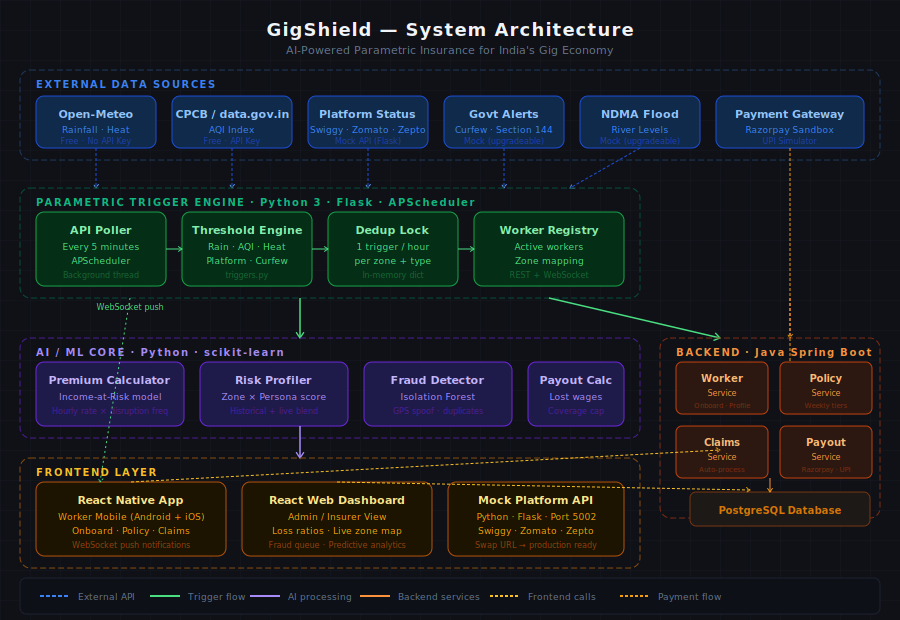
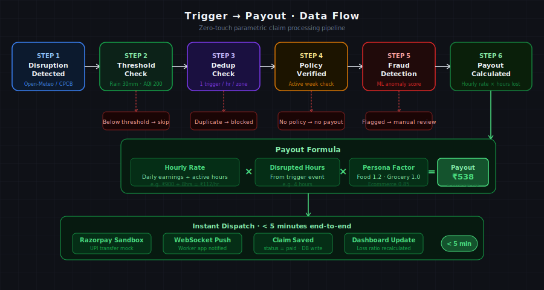
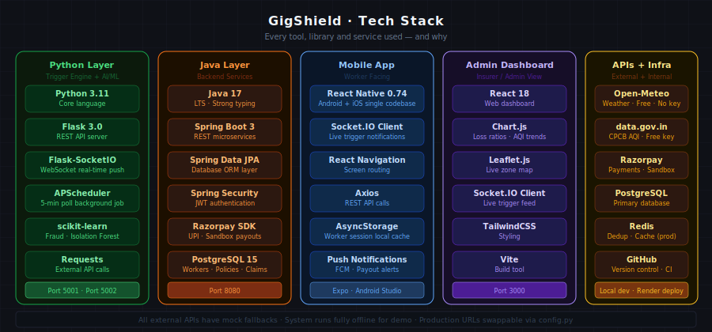

# GigShield 🛡️
### AI-Powered Parametric Insurance for India's Gig Economy

> **Guidewire DEVTrails 2026 — University Hackathon**
> Sri Eshwar College of Engineering


---

## Table of Contents

1. [Problem Statement](#1-problem-statement)
2. [Our Solution](#2-our-solution)
3. [System Architecture](#3-system-architecture)
4. [Parametric Trigger Engine](#4-parametric-trigger-engine)
5. [AI / ML Features](#5-ai--ml-features)
6. [Trigger → Payout Flow](#6-trigger--payout-flow)
7. [Adversarial Defense & Anti-Spoofing Strategy](#7-adversarial-defense--anti-spoofing-strategy)
8. [Complete Tech Stack](#8-complete-tech-stack)
9. [Build Status](#9-build-status)
10. [How to Run](#10-how-to-run)
11. [Team](#11-team)

---

## 1. Problem Statement

India has over **15 million** platform-based delivery workers employed by Zomato, Swiggy, Zepto, Blinkit, Amazon, and Flipkart. These workers are the backbone of India's digital economy — yet they have **zero financial protection** against income loss.

External disruptions such as extreme weather, hazardous air quality, city-wide curfews, or platform outages can wipe out **20–30% of their monthly earnings**. None of these disruptions are the worker's fault.

### Why Existing Solutions Fail

| Problem | Reality |
|---|---|
| Manual claim filing | Workers must submit proof and wait days for approval |
| No income protection | Health and vehicle insurance exist — income replacement does not |
| Rigid pricing | No insurance is priced on a weekly basis matching how gig workers actually earn |
| Zero transparency | Workers have no visibility into when a disruption qualifies for compensation |

---

## 2. Our Solution

GigShield is an **AI-enabled parametric insurance platform** that automatically protects gig workers' income when external disruptions occur.

**Parametric** means the system detects the disruption itself and triggers the payout automatically. The worker does nothing. Money just arrives.

### Traditional vs GigShield

| Traditional Insurance | GigShield Parametric |
|---|---|
| Worker files a claim | No action needed from worker |
| Submit documents and proof | Trigger detected automatically |
| Wait days or weeks | Payout in under 5 minutes |
| Claim may be rejected | Objective threshold — no disputes |

### The Three Personas We Cover

| Persona | Platforms | Sensitivity | Why |
|---|---|---|---|
| Food Delivery | Zomato · Swiggy | 1.2× | Income stops instantly when it rains |
| Grocery / Q-Commerce | Zepto · Blinkit | 1.0× | Baseline income loss rate |
| E-Commerce | Amazon · Flipkart | 0.85× | Slight buffer — indoor pickups possible |

---

## 3. System Architecture



GigShield is built across 4 layers, each with a clearly defined responsibility.

| Layer | Tech | Responsibility |
|---|---|---|
| **Trigger Engine** | Python · Flask · APScheduler | Polls 5 external APIs every 5 min, fires payout events when thresholds are crossed |
| **AI / ML Core** | XGBoost · Isolation Forest · scikit-learn | Dynamic premium pricing, fraud detection, disruption forecasting |
| **Backend Services** | Java 17 · Spring Boot 3 · PostgreSQL | Worker onboarding, policy management, claims processing, UPI payout dispatch |
| **Frontend** | React Native · React · Socket.IO | Worker mobile app, admin dashboard, real-time push notifications |

---

## 4. Parametric Trigger Engine

A single **centralized server** monitors conditions for all active workers simultaneously. Workers cannot influence the trigger — they never touch it.

### The 5 Disruption Triggers

| Trigger | Threshold | Source | Income Impact |
|---|---|---|---|
| Heavy Rainfall | > 30mm in 3hr | Open-Meteo | Bikes stop, roads flood |
| Hazardous AQI | AQI > 200 | CPCB via data.gov.in | Outdoor work unsafe |
| Extreme Heat | > 42°C | Open-Meteo | NDMA heat advisory |
| Platform Downtime | > 45 min down | Mock Platform Status API | No orders possible |
| Curfew / Section 144 | Any active order | Govt alert feed (mock) | Cannot access routes |

### Why Centralized Beats Phone-Based

- **Tamper-proof:** Worker never touches the trigger source
- **Scale:** One server handles all workers across all zones simultaneously
- **Consistency:** Verifiable data from independent third-party APIs
- **Dedup lock:** Same trigger cannot fire twice within 1 hour per zone
- **Privacy:** Workers check into a zone — GPS coordinates are never stored

### REST API Endpoints

| Method | Endpoint | Purpose |
|---|---|---|
| GET | `/api/health` | Health check |
| GET | `/api/zones` | List all configured zones |
| GET | `/api/workers/active` | All active workers by zone |
| POST | `/api/workers/register` | Worker goes online — starts coverage |
| POST | `/api/workers/deregister` | Worker goes offline — stops coverage |
| GET | `/api/triggers` | Last 100 trigger events |
| POST | `/api/triggers/manual` | Force a trigger for demo / testing |

---

## 5. AI / ML Features

### 5.1 Premium Calculator — XGBoost Model



Instead of a flat price, GigShield uses an **Income-at-Risk model** — the premium is based on what the worker actually stands to lose.

#### Premium Formula

```
Weekly Premium = MAX(
    Expected_Weekly_Loss × 0.65,    ← actuarial (65% loss ratio)
    Weekly_Earnings × 0.018          ← affordability cap (1.8%)
)

Example — Ravi Kumar (food delivery, Velachery, ₹900/day, monsoon):
  Hourly rate       = ₹900 ÷ 8 = ₹112/hr
  Disruptions/week  = (6.5 × 1.6) ÷ 4.33 = 2.4/week
  Expected loss     = ₹112 × 4hrs × 2.4 × 1.2 = ₹1,290/week
  Affordability cap = ₹5,400 × 0.018 = ₹97  ← this wins
  Final premium     ≈ ₹89/week (Standard tier)
```

#### Key Pricing Factors

| Factor | Example | Impact |
|---|---|---|
| Zone Disruption Frequency | Velachery: 6.5 events/month | Risky zone → higher premium |
| Persona Sensitivity | Food: 1.2× · Grocery: 1.0× | Food delivery pays more |
| Season Risk | Monsoon: 1.6× · Summer: 0.8× | Monsoon costs more |
| Shift Risk | Night: 1.25× · Morning: 0.90× | Night shift pays more |
| Experience Discount | 48 months → 15% off | Experienced workers pay less |

#### Coverage Tiers

| Tier | Weekly Premium | Weekly Coverage Cap |
|---|---|---|
| Basic | ₹49 | ₹2,000 |
| Standard ⭐ | ₹89 | ₹4,500 |
| Premium | ₹149 | ₹8,000 |

#### Model Stats

- **Algorithm:** XGBoost Gradient Boosting Regressor (200 trees, max depth 6)
- **Training data:** 5,000 synthetic worker records (Monte Carlo, grounded in IMD/CPCB/IRDAI data)
- **Accuracy:** MAE < ₹10 · R² > 0.96
- **Top feature:** `daily_earnings` (0.48 importance) — model learned real-world actuarial logic

### 5.2 Fraud Detection — Isolation Forest (Phase 2)

- **Layer 1 (Built):** Triggers come from third-party APIs — worker structurally cannot initiate a false trigger
- **Layer 2 (Phase 2):** Duplicate checks, zone validation, velocity flagging (>3 claims/7 days)
- **Layer 3 (Phase 3):** Isolation Forest flags statistical outliers vs. cohort claim patterns

### 5.3 Predictive Disruption Forecasting (Phase 3)

Random Forest classifier predicts next week's disruption probability per zone — pre-warns insurers of high-claim weeks before monsoon peaks hit.

---

## 6. Trigger → Payout Flow

Zero-touch parametric claim processing — from disruption detection to worker's UPI in under 5 minutes.

| Step | Action | Detail |
|---|---|---|
| 1 | Disruption detected | Rainfall reaches 42mm in 3hr — exceeds 30mm threshold |
| 2 | Policy check | Confirms active Standard tier policy for this week |
| 3 | Fraud check | No duplicate claim, zone matches, no anomaly |
| 4 | Payout calculated | ₹112/hr × 4 disrupted hrs × 1.2 persona = **₹538** |
| 5 | Cap check | ₹538 < ₹4,500 weekly cap — full amount approved |
| 6 | Payout dispatched | ₹538 sent to UPI via Razorpay sandbox |
| 7 | Audit logged | status = paid · dashboard updated · loss ratio recalculated |

### Payout Formula

```
Payout = (Daily_Earnings ÷ Active_Hours) × Disrupted_Hours × Persona_Factor

Final payout = MIN(calculated_payout, remaining_weekly_cap)
```

---

## 7. Adversarial Defense & Anti-Spoofing Strategy

> *Phase 1 — Market Crash Response*

### The Attack

A coordinated fraud ring exploiting a parametric insurance platform operates like this:

1. **Fake GPS signals** simulate delivery partner locations inside a trigger zone (flood, outage, heat)
2. **500 accounts** controlled by the same ring all appear in the trigger zone simultaneously
3. **Automated claim submissions** flood the system at payout time, draining the liquidity pool before anomalies surface

Simple GPS verification is dead. GPS spoofing apps are cheap, widely available, and undetectable in isolation. Our defense is **multi-signal, behavioral, and cross-account**.

---

### Layer 1 — Multi-Source Location Corroboration

A real worker stranded by a flood leaves **multiple independent location traces** that are hard to simultaneously fake.

| Signal | What it proves |
|---|---|
| GPS coordinates | Base location claim |
| Cell tower triangulation | Network-layer location (independent of GPS) |
| IP geolocation | Rough but GPS-independent cross-check |
| Platform activity history | Past delivery zones, home base patterns |
| Device sensor data | Accelerometer / gyroscope — is the device moving like a person? |

**Rule:** A claim is corroborated only if **≥ 3 of these 5 signals** place the worker in or near the trigger zone. A GPS coordinate that contradicts every other signal is flagged — not paid.

Spoofing GPS is trivial. Simultaneously spoofing GPS + cell tower data + IP geolocation + device sensor physics is orders of magnitude harder.

---

### Layer 2 — Behavioral Anomaly Detection

Genuine workers have natural behavioral fingerprints. Fraud rings don't.

**Within the session:**
- Does the GPS path show realistic movement (walking speed, stops, turns) — or is it teleporting / perfectly stationary?
- Did the worker interact with the delivery platform before the trigger event? Real workers are actively working, not idle and waiting for a payout.
- Is battery level, signal strength, and timestamp metadata internally consistent?

**Across accounts — the ring-detection signal:**
- Are multiple accounts submitting from GPS coordinates within an implausibly tight radius (e.g., 20 accounts from the same 10-meter spot)?
- Do multiple accounts share a device fingerprint, SIM history, or registration IP?
- Were several accounts created or activated in a short window just before a trigger event? (Classic sleeper account pattern)
- Do claim submission timestamps cluster unnaturally? Real workers notice and respond to events at different times. A fraud ring hits submit at the same millisecond.

Each signal contributes to a **composite risk score**. No single signal alone disqualifies a claim — the convergence of signals is what catches a ring.

---

### Layer 3 — Graph-Based Ring Detection

Individual account analysis misses coordinated rings. We model the worker population as a **graph**:

- **Nodes** = worker accounts
- **Edges** = shared attributes (same device, same IP at registration, same GPS cluster, synchronized claim timing)

A fraud ring forms a **dense subgraph** — many accounts tightly connected by shared signals. Genuine workers form sparse, loosely connected clusters.

When a trigger fires, we run a **density check** on the claimant graph:

| Subgraph Density | Action |
|---|---|
| Low (isolated node) | Fast-track for payout |
| Medium | Standard verification queue |
| High (dense cluster) | Hold for manual review |

This is how we tell "500 real delivery workers all hit by a genuine flood" apart from "500 fake accounts controlled by 10 people."

---

### Layer 4 — Parametric Trigger Integrity

A sophisticated attacker may try to **manipulate the trigger itself** — feeding false data to the oracle that declares the event, rather than spoofing worker locations.

Our defenses:

- **Multi-oracle consensus:** An event is only confirmed when **multiple independent sources agree** (IMD weather data + satellite imagery + platform API status + third-party monitoring). One source can be manipulated. Four corroborating sources cannot be silently falsified together.
- **Trigger audit trail:** Every trigger is logged with raw data from all oracles, timestamped and hash-chained. Retroactive manipulation is detectable.
- **Batched payout release:** Even on a genuine trigger, payouts release in **batches with a short delay** — giving the anomaly detection pipeline time to run before funds leave the pool.

---

### Layer 5 — Graduated Response (Protecting Honest Workers)

The most dangerous design failure is a binary pay / reject decision. That punishes genuine workers caught in edge cases — poor signal area, old phone, unusual location — alongside fraudsters.

| Risk Score | Action |
|---|---|
| 0 – 30 | Auto-approve, standard payout |
| 31 – 60 | Request one lightweight verification (OTP to registered mobile, or timestamped selfie) |
| 61 – 85 | 24-hour hold with clear worker notification and explanation |
| 86 – 100 | Manual investigation; account temporarily frozen pending review |

Workers at medium risk are **never rejected** — they are asked for one more data point. Workers at high risk receive a clear explanation and a **human review path**, not a silent denial.

A fraud ring won't complete verification steps for 500 fake accounts. A genuine stranded worker will.

---

### The Decisive Signals: Faker vs. Genuinely Stranded Worker

| Signal | Genuine Worker | Fraud Ring Account |
|---|---|---|
| Location corroboration | GPS matches cell tower + IP | GPS contradicts all other signals |
| Platform history | Active deliveries before event | Dormant or newly created account |
| Device movement | Natural movement pattern | Stationary or teleporting GPS trace |
| Cross-account links | No shared device/IP with others | Shares fingerprint with many accounts |
| Claim timing | Human-paced submission | Millisecond-synchronized batch |
| Verification behavior | Completes steps willingly | Drops off at any friction point |
| Graph structure | Isolated node | Part of a dense fraud subgraph |

No single signal is decisive. **The convergence of signals is what separates the real worker from the ring** — and GigShield's architecture reads that convergence at scale, in real time, before a single rupee leaves the pool.

---

## 8. Complete Tech Stack



| Layer | Technology | Port |
|---|---|---|
| Trigger Engine | Python 3 · Flask 3.0 · APScheduler · Flask-SocketIO | 5001 |
| Mock Platform API | Python · Flask | 5002 |
| ML Core | XGBoost · scikit-learn · pandas · joblib · Flask | 5003 |
| Backend | Java 17 · Spring Boot 3 · Spring Data JPA · Spring Security · PostgreSQL | 8080 |
| Payment | Razorpay SDK (sandbox) · UPI simulator | — |
| Mobile App | React Native 0.74 · Socket.IO Client | — |
| Admin Dashboard | React 18 · Vite · Chart.js · Leaflet.js | 3000 |
| Weather API | Open-Meteo (free, no key required) | — |
| AQI API | CPCB via data.gov.in | — |

---

## 9. Build Status

### Phase 1 — Foundation (March 4–20) ✅

| Component | Status |
|---|---|
| Centralized parametric trigger engine | ✅ Done |
| 5 disruption triggers (rain, AQI, heat, platform, curfew) | ✅ Done |
| Zone-based worker registry with dedup lock | ✅ Done |
| REST API (7 endpoints) + WebSocket real-time push | ✅ Done |
| Mock Platform Status API (port 5002) | ✅ Done |
| XGBoost Premium Calculator | ✅ Done |
| Synthetic training data generator (5,000 records) | ✅ Done |
| System architecture diagrams | ✅ Done |
| Adversarial Defense & Anti-Spoofing Strategy | ✅ Done |

### Phase 2 — Automation & Protection (March 21 – April 4) ⏳

| Component | Status |
|---|---|
| Worker registration + policy creation (Spring Boot) | ⏳ Next |
| Claims service — auto-process pending_payout events | ⏳ Next |
| Payout dispatch via Razorpay sandbox | ⏳ Next |
| Isolation Forest fraud detection model | ⏳ Next |
| React Native worker mobile app | ⏳ Next |

### Phase 3 — Scale & Optimise (April 5–17) 🔜

| Component | Status |
|---|---|
| React admin dashboard | 🔜 Upcoming |
| Predictive disruption forecaster | 🔜 Upcoming |
| Full end-to-end demo video | 🔜 Upcoming |

---

## 10. How to Run

### Prerequisites
- Python 3.11+ with pip
- Java 17+ with Maven
- Node.js 18+
- PostgreSQL 15

### Step 1 — Trigger Engine (Port 5001)

```bash
cd Trigger_System
python -m venv venv
source venv/bin/activate       # Mac/Linux
venv\Scripts\activate          # Windows
pip install -r requirements.txt
python app.py
```

Expected output:
```
[INFO] Starting GigShield Parametric Trigger Engine...
[INFO] Seeded 5 demo workers across zones
[INFO] Scheduler started: polling every 300s
[INFO] Server starting on http://localhost:5001
```

### Step 2 — Mock Platform API (Port 5002)

```bash
# New terminal
cd Trigger_System
python mock_platform_api.py

# Simulate a platform outage
curl -X POST http://localhost:5002/api/status/zomato/down \
  -H "Content-Type: application/json" \
  -d '{"reason": "Server overload", "affected_cities": ["Chennai"]}'
```

### Step 3 — Premium Calculator ML API (Port 5003)

```bash
# New terminal
cd ML_Premium
pip install xgboost scikit-learn pandas numpy joblib flask flask-cors
python app.py
# Model trains automatically on first run (~30 seconds)
```

### Quick Test — All Endpoints

```bash
# Health checks
curl http://localhost:5001/api/health
curl http://localhost:5003/api/premium/health

# Active workers and recent triggers
curl http://localhost:5001/api/workers/active
curl http://localhost:5001/api/triggers

# Calculate a premium
curl -X POST http://localhost:5003/api/premium/calculate \
  -H "Content-Type: application/json" \
  -d '{"worker_id":"W001","zone_id":"zone_chennai_velachery","persona":"food","daily_earnings":900,"active_hours":8,"shift":"afternoon","season":"monsoon","days_per_week":6,"experience_months":12}'

# Fire a manual trigger (demo)
curl -X POST http://localhost:5001/api/triggers/manual \
  -H "Content-Type: application/json" \
  -d '{"zone_id": "zone_chennai_velachery", "trigger_type": "rainfall", "value": 45}'
```

---

## 11. Team

| | |
|---|---|
| **College** | Sri Eshwar College of Engineering |
| **Team Name** | DevTrails |
| **Hackathon** | Guidewire DEVTrails 2026 — University Hackathon |

### Members

| # | Name |
|---|---|
| 1 | Yogeshwaran K |
| 2 | Praveen Raju K |
| 3 | Sriram S |
| 4 | Vishnu RM |
| 5 | Sanjith Senthilkumar |

---

*GigShield — Protecting India's Gig Workers, One Week at a Time.*
